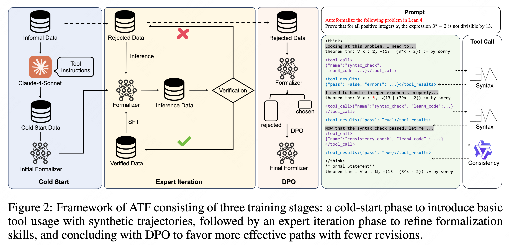
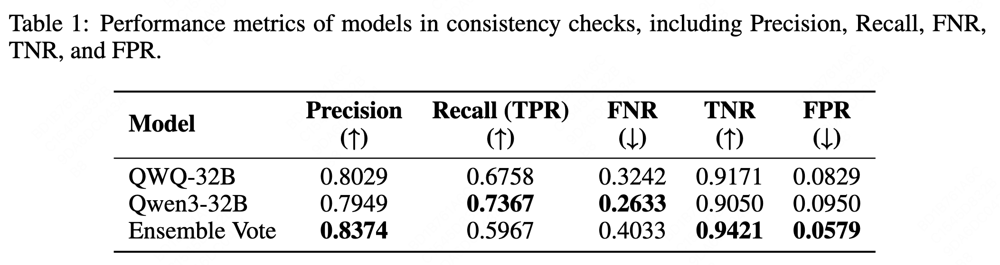
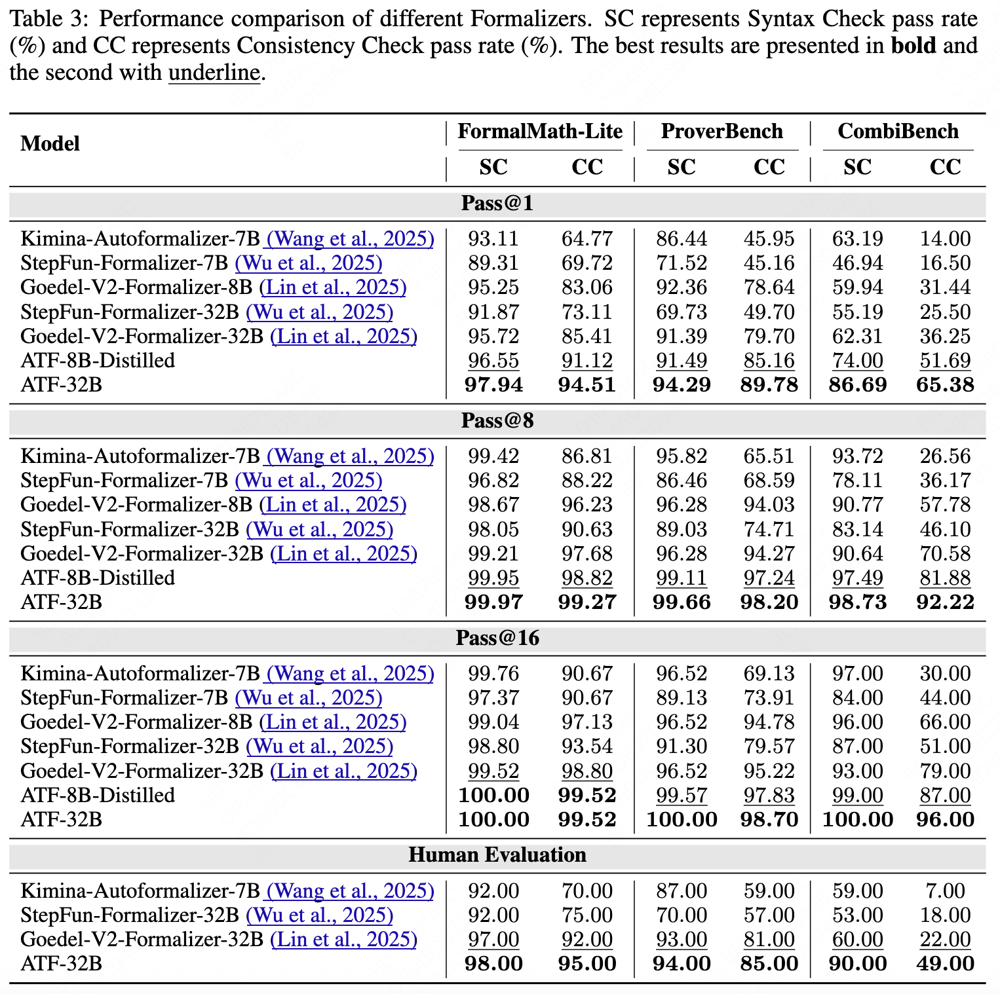

# Autoformalizer with Tool Feedback (ATF)

Autoformalizer with Tool Feedback (ATF) aims to enhance the process of autoformalization by incorporating **syntactic** and **semantic** validation tools, thereby improving the accuracy and reliability of formal statements generated from natural language mathematical problems.

<div align="center"> 
        <a href="https://arxiv.org/pdf/2510.06857"></a> &ensp;
        <a href="https://qguo-create.github.io/ATF-blog.github.io/"></a> &ensp;
</div>

## Overview

Autoformalization addresses the scarcity of data for Automated Theorem Proving (ATP) by translating mathematical problems from natural language into formal statements. ATF introduces a novel approach that integrates syntactic and semantic consistency information as tools into the formalization process. By leveraging Lean 4 compilers for syntax corrections and employing a multi-LLMs-as-judge approach for consistency validation, ATF adaptively refines generated statements according to tool feedback, enhancing both syntactic validity and semantic consistency.

## Key Features
- **Tool Feedback Integration**: ATF uses syntactic and consistency validation tools to guide the formalization process, ensuring high-quality formal statements.
    - **Syntax Check**: The syntax validity is assessed using feedback from the Lean 4 compiler, which directly determines the correctness of formal statements' syntax. Before execution, a pre-check phase is employed to filter out statements with obvious syntax errors such as mismatched parentheses.
    - **Consistency Check**: For consistency judgment, two open-source large models, QWQ-32B and Qwen3-32B, are used independently, with final results based on ensemble voting. Experiments show this method significantly improves detection of subtle semantic inconsistencies, reducing the false positive rate (FPR) from approximately 9% with a single model to below 6%.


- **Three Stage Training**:
    - **Cold-Start Phase**: Introduces basic tool usage with synthetic trajectories to familiarize the model with tool-driven revisions.
    - **Expert Iteration Phase**: Enhances formalization capabilities through iterative refinement and expert feedback.
    - **Direct Preference Optimization (DPO)**: Reduces ineffective revisions and encourages the model to complete formalization in fewer attempts.

- **Open-Source Dataset**: We opensource Numina-ATF, a dataset containing 750K synthetic formal statements, is provided to facilitate advancements in autoformalization and ATP research.

## Benchmark Performance


## Downloads
The models and dataset are available on Hugging Face Hub:

| Type | Name                  | Hugging Face Link                                                                 |
|--------------|-------------------------------|-----------------------------------------------------------------------------------|
| Model   | ATF-32B             | [link](https://huggingface.co/datasets/lulululuyi/R-HORIZON-Math500)             |
| Model   | ATF-8B              | [link](https://huggingface.co/datasets/lulululuyi/R-HORIZON-AIME24)               |
| Dataset   | Numina-ATF              | [link](https://huggingface.co/datasets/lulululuyi/R-HORIZON-AIME25)               |


## Quick Start

### Installation

To reproduce the results, clone this repository and install the necessary dependencies:

```bash
git clone https://github.com/qguo-create/Autoformalizer-with-Tool-Feedback.git
cd Autoformalizer-with-Tool-Feedback
pip3 install -r requirements.txt
```

### Evaluation

The repository includes scripts for evaluating the ATF model and other baselines. You can start evaluation by running the following command:

To evaluate the ATF models.
```bash
sh scripts/run_atf.sh
```

To evaluate other baselines.
```bash
sh scripts/run_baselines 
```

## License

This project is licensed under the MIT License.

## Citations

```bibtex
@article{guo2025autoformalizer,
  title={Autoformalizer with Tool Feedback},
  author={Guo, Qi and Wang, Jianing and Zhang, Jianfei and Kong, Deyang and Huang, Xiangzhou and Xi, Xiangyu and Wang, Wei and Wang, Jingang and Cai, Xunliang and Zhang, Shikun and others},
  journal={arXiv preprint arXiv:2510.06857},
  year={2025}
}

```